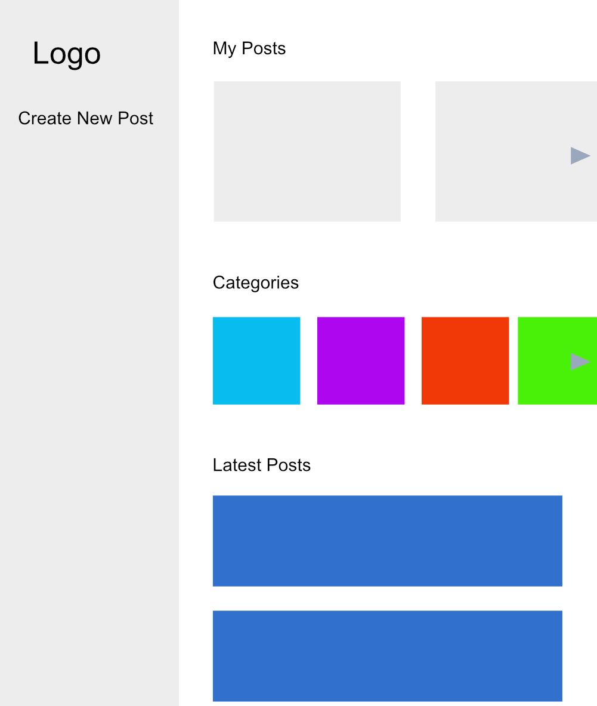

# Threadarium

Threadarium is a forum app that lets users create posts and read posts shared by others. Users can also spark discussions or have conversations through commenting on any post that they find interesting or fun! Share your thoughts, secret recipes, playlists, movie/series/game recommendations.. **Anything goes, but PLEASE keep it clean!**

## Technologies Used

- Python (Django framework)
- HTML
- Tailwind CSS
- PostgreSQL
- Heroku (deployment)
- Neon (Postgres database hosting)

## Getting Started

Check out the site [here]()!

Visit Threadarium's [Trello](https://trello.com/b/Szz6rUb1/threadarium) board to view additional details.

## Screenshots

 

## Next Steps

Future enhancements:

- [ ] Add feature to create comment threads (commenting on a parent comment)
- [ ] Add feature post categorization
- [ ] Improve app UI and styles
- [ ] Add feature to upload images
